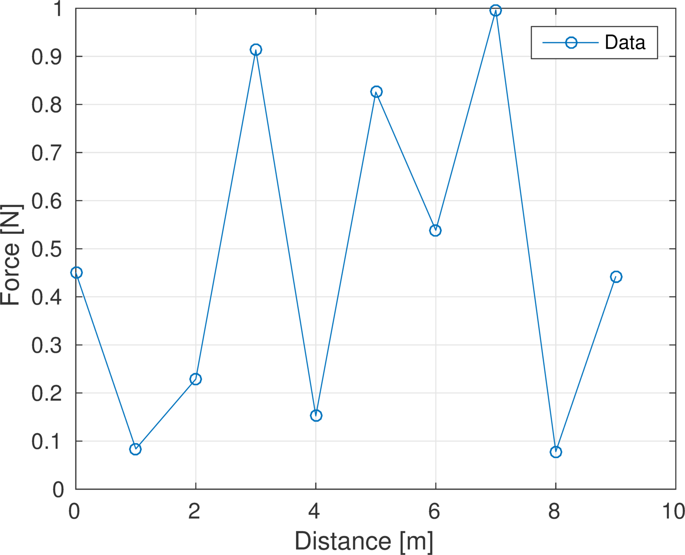

Generating high-quality figures for documents — theses, papers — can be
challenging. In general you will want to generate an image file from the figure
window and then include that image in your document. Below are general notes with a
Linux-specific example.

## export_fig

The [export_fig utility from the MathWorks File
Exchange](https://www.mathworks.com/matlabcentral/fileexchange/23629-export-fig)
does most of the heavy lifting of saving high-resolution images from MATLAB
figures. Download the zip archive and place it somewhere MATLAB can find the `.m`
file — you can set the MATLAB path so that `export_fig.m` is always found.

Read the README and the File Information on File Exchange for documentation. In
particular, you will need to install Ghostscript.

## Example

```matlab
% Set the default text sizes for the root figure
set(0,'defaulttextfontsize',20);
set(0,'defaultaxesfontsize',12);

% Set the background color to white
set(gcf,'color','w');

% Here is an example figure
figure(1);
clf();
plot(0:9,rand(10,1),'o-')
xlabel('Distance [m]')
ylabel('Force [N]')
legend('Data')
grid on;

% Now call export_fig to generate a png image file at 300 dpi
export_fig example.png -png -r300 -painters
```

If all goes well you will have an image file `example.png` in your working
directory that looks like this:

{width=500 fig-alt="MATLAB line plot exported with export_fig, showing labeled axes with engineering units and a legend."}

Note that the figure carries no title — the title belongs to the document, not the
image. See [technical writing notes](technical-writing.qmd) for the distinction
between figure titles and captions.

## MATLAB wrappers

Personally I get tired of typing all of that, or putting it in every script, so I
have convenience functions for creating figures for publication. They live in the
[frlbox repository](https://github.com/bsb808/frlbox); the figure export scripts —
`pubfig.m` and `exfig.m` — are in
[figbox](https://github.com/bsb808/frlbox/tree/master/figbox).
