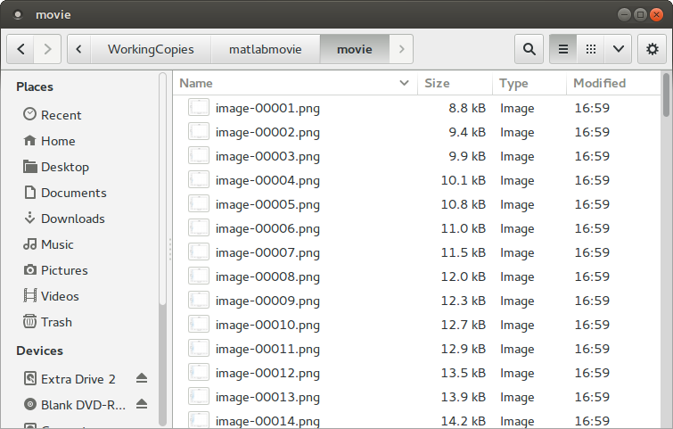

There are a few ways to generate movies, videos, and animations with MATLAB. Below
is one method that works with Linux/Ubuntu. There are two basic steps:

1. In MATLAB, generate a sequence of images and save them as sequentially named
   files — `image-001.png`, `image-002.png`, and so on.
2. In Linux, use a tool like `ffmpeg` or `avconv` to generate a movie file from the
   image sequence.

The code for these examples is at
[github.com/bsb808/matlabmovie](https://github.com/bsb808/matlabmovie).

## Step 1: generating the image sequence

This example uses [export_fig](figures-for-writing.qmd) to generate a sequence of
images in a `movie` directory.

```matlab
% Example of creating a MATLAB animation
% For the example we will create a sequence of images, saving each image in
% the sequence to a file.  Then, externally (not in MATLAB) we will combine
% the images into a video file.

% Create a sequence of images
N = 100;
figure(1);
clf();
YY = [];
for ii = 1:N
    YY(ii) = rand();
    plot(1:ii,YY,'o-')
    xlabel('Distance [m]')
    ylabel('Force [N]')
    title(sprintf('Step %d',ii));
    grid on;
    axis([0 N 0 1])

    % Save each figure as a image file (.png)
    % The number of the image is included in the file name
    % Make sure there is a directory called "movie" in your current working
    % directory.
    fname = sprintf('movie/image-%05d',ii);
    % Saves each image at 72 dpi.  May want to adjust the resolution
    cmd = sprintf('export_fig %s -png -r72 -painters',fname);
    eval(cmd)
end
```

You should now have a directory full of images:

{width=500 fig-alt="File listing showing a sequence of numbered PNG image files produced by the MATLAB script."}

## Step 2: generating the movie

The following command finds those images and converts them into `out.mp4`:

```bash
avconv -framerate 4 -i "./movie/image-%05d.png" -c:v libx264 -r 20 \
  -pix_fmt yuv420p -crf 20 \
  -vf "scale=trunc(iw/2)*2:trunc(ih/2)*2" out.mp4
```

The syntax is equivalent for `ffmpeg`. There are a number of cryptic options here.

If all goes well you have a movie:

<video src="../assets/matlab-movie-example.mp4" controls width="500"></video>

The video quality here is not especially high. To improve it, adjust the image
resolution in MATLAB, the command-line options to `avconv`/`ffmpeg`, or both.

::: {.callout-note appearance="simple"}
Unlike a figure for a document, an animation of this kind reasonably carries its
own title — note the `title()` call in the script above.
:::
